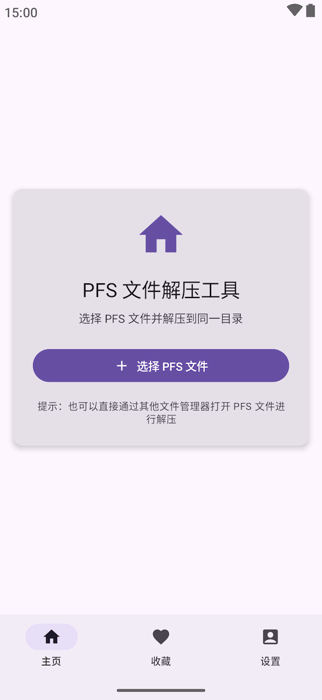

# PFS-Android

## Android App for unpack PFS archives

> PFS archives are proprietary archives used by the [Artemis](https://www.ies-net.com/) galgame engine.

## Features

- Unpack PFS archives by selecting files in App
- Quick unpack PFS archives from file explorer

## Build

1. Install [Rust](https://www.rust-lang.org/tools/install) and Android NDK
2. Install cargo-ndk: `cargo install cargo-ndk`
3. Run script `./build-jni.sh release` to build Rust library for Android
4. Build APK

## Preview

